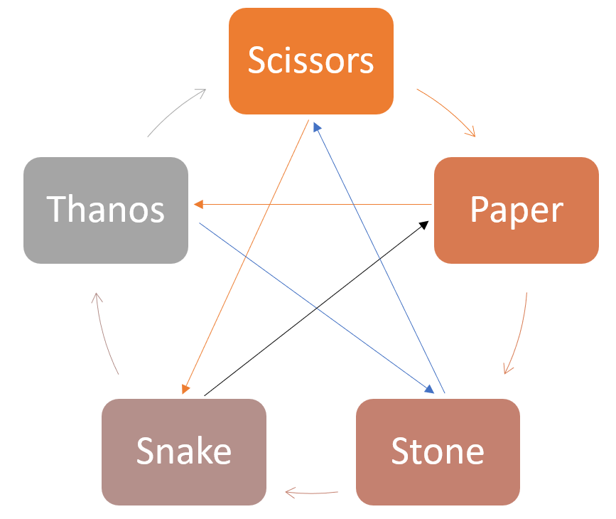
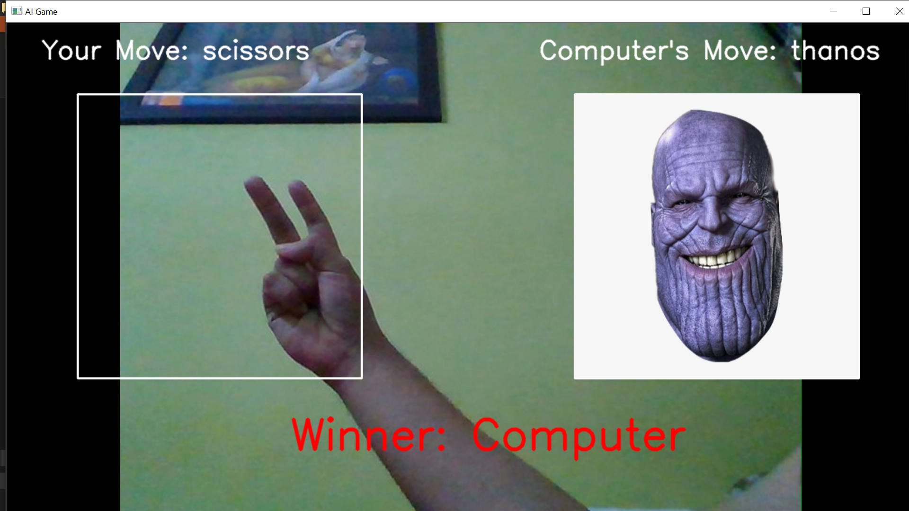
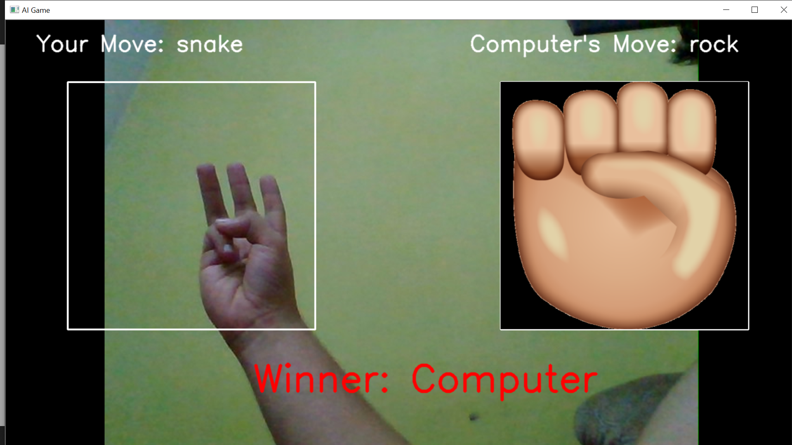
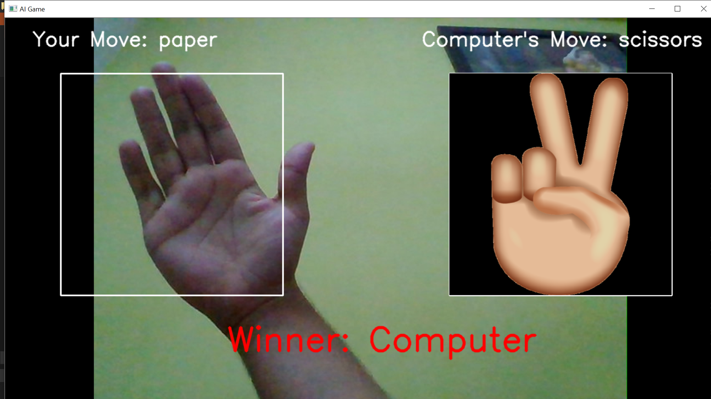

# AI-Project
This game is a little bit different version of Sheldon Cooper's Stone paper scisscor game. Here I replaced spock with thanos and lizard with snake. 

## Requirements
- Keras -> to tain the model
- Tensorflow -> for image processing
- OpenCV -> to use webcam

## Rules of Game

- Scissors cuts Paper
- Paper covers Rock
- Rock crushes Snake
- Snake poisons Thanos
- Thanos smashes Scissors
- Scissors decapitates Snake
- Snake eats Paper
- Paper disproves Thanos
- Thanos vaporizes Rock
- Rock crushes Scissors

## Dataset
I created my own dataset by gathering 200 images of all gestures(
-Scissors
-Rock
-Paper 
-Thanos
-Snake
-None (for defining no movement)

## How game works
Computer selects a gesture randomly when it detects a movement and displays the results after getting to know what was human's gesture.

## Setup
1. Install required libraries
2. Create your own database by using gather_images.py (I took 200 pictures of each gesture so that it is easy for pc to recognize you hand gesture in differnt positions)
3. After that use train.py to create training model(If there is too much loss then rerun the file)
4. Now play your game with play.py

## Screenshots

